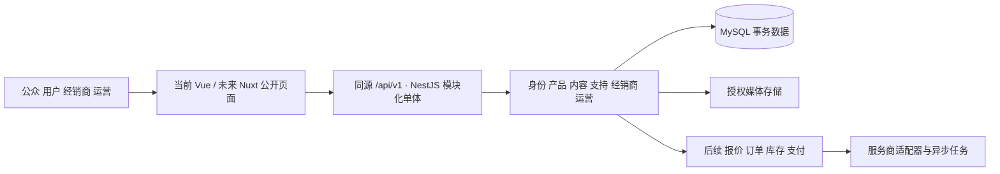

# WEMOVE 长期规划与开发启动方案

_规划版本 0.2 · 2026-09-05 · 面向七人开发团队_

WEMOVE 应先成为后台可维护、身份可验证、数据可持久保存的品牌与产品门户；随后建立经销商业务、SEO 与运营能力，最终在业务条件具备时开放交易。本方案把长期需求全部保留在路线图中，用分期验收控制课程版本的实现范围。

## 规划决策

1. 延续 Vue 3 / Vite / Pinia / Element Plus，逐领域接入 API，保持现有代码可运行。公开网站商业上线前迁移至 Nuxt SSR/混合渲染，管理功能继续采用 Vue。
2. 新后端采用 NestJS 模块化单体与 TypeScript；先一个应用、一个数据库。各领域有独立模块与导出接口，未来有测量依据再拆服务。
3. 沿用 MySQL，目标 MySQL 8.4 LTS；使用 TypeORM 显式迁移，`synchronize=false`。避免为遵循需求中的“建议”而立即更换 PostgreSQL。
4. lizhikeer 多承担早期前端基础、公共组件及首批前端联调，负责最终全站 UI 设计和收口；cy0207kaw 负责后端骨架与鉴权，其余成员各自承担完整领域。最终集成、回归、答辩为全员责任。
5. 课程核心必须有真实注册登录、密码找回、后台新闻/产品维护与持久化。现有本地角色切换及模拟已支付订单不得充当验收证据。
6. 用户已指定Docker部署到Linux服务器。统一使用单机Compose编排web/api/db与一次性迁移，数据卷独立持久化，公开入口经Nginx；详情见 [Docker与Linux部署基线](deployment.md)。

## 分期与里程碑

用户已明确课程作业需在 **2–3 天**内完成。以实际启动日 T0 为起点，第3天方案含最终回归缓冲；若只有2天，执行下面的压缩规则。具体日历截止时刻尚未给出，GitHub 里程碑不写假定 due date。

| 阶段 | 建议时间 | 交付门槛 |
| --- | --- | --- |
| M0 开发基线 | 第1天上午 | 2小时内冻结范围与接口；半天内完成最小后端、迁移、身份和公共前端 |
| M1 课程核心闭环 | 第1天下午–第2天中午 | 新闻、产品、账户、联系表单、基础设置由真实数据库驱动 |
| M2 经销商增强 | 第2天下午，可裁剪 | 仅申请、审核、本人状态；补件、企业团队和私有资料延后 |
| M3 UI 与课程交付 | 第2天下午–第3天 | lizhikeer 统一 UI；全员回归、安全/性能检查、课程材料与答辩 |
| M4 产品完善 | 课程版后第1–2月 | 经销商完整闭环、SSR、英文内容、SEO、MFA、媒体治理、监控与运营验证 |
| M5 交易与运营增长 | 课程版后第3–6月 | 多语言/市场、授权价格、报价、B2B 订单，再逐步开放 B2C 支付、库存、售后及外部集成 |

仅有2天时：取消 M2 经销商增强、FAQ 后台、资料上传增强、复杂统计和动画，保留公开支持内容和真实联系表单；第2天中午冻结功能。M1 注册/登录/密码找回、新闻/产品维护、用户管理、基础设置及课程文档不能用 Mock 替代。SSR、支付等长期能力不能写成已完成。

## 启动顺序

首日开始后30分钟内共同阅读 [范围基线](scope-baseline.md)，在 B00 留下确认；chenyi-c 补录截止时刻和实名映射，lizhikeer 冻结页面和前端字段，cy0207kaw 冻结服务端契约。Snowed-night 同步准备课程表结构，22099yang 清点必要资源，其余成员准备领域代码与测试样例。

M0 骨架合并后按依赖联调 M1；等待骨架期间可按契约开发独立领域代码，但不得各起一套后端。第1天结束必须演示“后台发布一条新闻或产品→前台读取数据库”。第2天午间演示全部核心闭环；第2天晚或第3天早冻结功能，lizhikeer 集中做 UI，各领域修复自己的缺陷。

## 可维护的架构远景

详见 [架构](architecture.md)、[数据库](database.md)、[API](api-contract.md)。这些是设计，不代表相应服务已经部署。

## 质量目标与证据

以 [质量与交付](quality-release.md) 定义的用例、100并发关键页面测试、越权测试、真实浏览器和恢复演练作为门槛。性能和可用性数值都是目标；本轮只有规划检查及现有前端构建验证，不宣称业务已通过。

工作入口见 [Issue 索引](issue-index.md)。每项都有负责人、依赖、验收和交付路径；M4/M5 按 Epic 管理，进入该阶段再细化实现任务。
