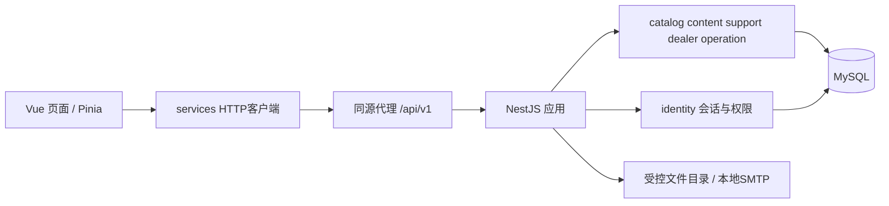

# 前后端架构与演进设计

## 方案选择

| 方案 | 适合度 | 代价与结论 |
| --- | --- | --- |
| 延续Vue，新增模块化单体和MySQL | 推荐用于2–3天课程 | 保留现有页面、图片和SQL知识；同一语言栈减少切换 |
| 立即改Nuxt并拆公开站/管理端 | 长期适用 | 路由、SSR兼容与部署改造占用本次联调时间，放M4 |
| Next.js/PostgreSQL重建或微服务 | 暂不采用 | 无现有代码复用优势，跨服务事务和部署开销超过当前收益 |

NestJS 用模块封装领域服务并显式导出公共接口，适合一个进程内建立责任边界；这是框架能力，不代表项目已实现。[^1] MySQL 8.4属于LTS系列；本项目选择沿用数据库生态。[^2]

## 课程运行结构

开发模式 Vue 默认3000，API建议3001，使用Vite代理；交付环境由Nginx把 `/api/` 转发给后端，并提供前端静态文件。只有没有 `/api/` 前缀的页面请求才走SPA fallback，禁止把API的404包装成index.html。上传目录独立于代码目录，数据库不直接暴露公网。

课程只需一台开发/演示机器、一个API进程和一份演示数据库。本轮不启动这些未来服务，不要求Redis、消息队列、Kubernetes或云资源。

## 前端责任边界

沿用 `views/`、`components/`、`stores/`，页面达到复杂度时再按领域拆子目录。`AdminView.vue` 当前汇聚多个业务，后续分为产品、内容、经销商、用户和运营路由，各领域维护自己的后台页面。

| 层 | 负责 | 禁止事项 |
| --- | --- | --- |
| 路由与布局 | public、account、admin边界；页面懒加载；404 | 路由隐藏不能代替后端授权 |
| views | 展示、表单、loading/empty/error/403/404 | 直接访问SQL或散落HTTP调用 |
| services | axios统一实例、超时、Cookie、CSRF、错误映射 | 网络失败时悄悄回退到假数据 |
| stores | 当前会话摘要、界面状态、必要缓存 | 在localStorage存密码/令牌、信任本地角色 |
| components/styles | UI组件、间距、字体、层级和断点 | 每个领域复制全局样式或另装UI库 |

lizhikeer 在首日上午统一 tokens、按钮/表单/卡片/弹窗、Header/Footer 和反馈状态；最后一阶段拥有全站 UI 设计与视觉验收责任。普通业务页面由领域成员实现，他集中调整共同样式及最重要的首页/产品页视觉。弹窗保留现有 `append-to-body` 修复，同时验证Esc、焦点返回与键盘导航。

当前代码保持JavaScript，不在3天内全量改TS。新增HTTP模块可用JSDoc记录契约；M4再渐进引入TS和由OpenAPI生成的类型。筛选条件进入URL；约定 `/products/category/:slug` 与 `/products/:slug`，避免原需求中分类和详情共用同一匹配模式。旧 `/product/:id` 保留兼容；商业上线时由服务端301映射到新slug。

Mock必须有显式开发开关及界面标识。课程验收使用真实API模式；无法连接时显示错误，不切回localStorage成功态。浏览器的旧演示数据与新会话无关，不能直接导入后端。

## 后端模块

建议 Node24 / NestJS11 / TypeScript / TypeORM / MySQL8.4，具体依赖精确版本在B01提交锁文件并验证，不使用未锁定的最新版本安装命令作为团队环境。

| 模块 | 对外服务 | 课程负责人 |
| --- | --- | --- |
| identity | 注册、登录、会话、找回、用户状态、管理员角色 | cy0207kaw |
| catalog | 产品、分类、公开产品DTO、发布校验 | Snowed-night |
| content | 新闻/品牌页、分类、草稿与发布 | serein7758521 |
| support/media | 联系工单、FAQ、媒体目录、上传/下载鉴权 | 22099yang |
| dealer | 申请/审核/本人状态，后续企业边界 | GLOCKDDD |
| operation | 网站设置、Banner、只读概览、审计查询 | chenyi-c |

每个模块使用 `controller → service → TypeORM repository`，DTO验证在入口，事务在业务服务中。Controller不写跨表业务，返回显式DTO，不直接序列化数据库实体。课程不增加泛型Repository框架、事件总线或独立服务；模块间通过导出服务调用，禁止随意写别人表。

共用能力由cy0207kaw提供：request_id、异常过滤、数据库连接、认证/角色守卫、会话与CSRF、限流。Snowed-night维护迁移顺序；各领域各写自己的迁移。鉴权、找回令牌、审计字段不能散落复制。

## 长期结构与迁移门槛

M4公开官网逐步演进为Nuxt SSR/混合渲染，先验证首页、一个产品详情与一篇新闻；通过索引HTML、404状态、登录隔离、缓存失效和移动端回归后扩展。Nuxt支持服务端和混合渲染。[^3] 后台和私有账户页不参与公开缓存。

公开缓存仅存已发布的匿名DTO；键包含路径/语言/市场/内容版本，绝不缓存身份、经销商价格、草稿或私有文件。发布/下架后失效；M4目标60秒内更新。先用短TTL和同步失效，只有实际需要可靠异步投递才引入数据库outbox及worker。

市场与翻译按独立表扩展，数据库继续沿用MySQL。新增Nuxt不会搬迁业务规则到浏览器或SSR服务器，后端仍是价格与权限的唯一裁决者。

媒体逐步迁移S3兼容存储/CDN；后台强制MFA和私有文件扫描为商业上线门槛。需要多实例会话或任务处理时引入Redis；数据库索引/查询计划优化后仍不能满足测量目标才接搜索引擎。只有独立扩容或独立发布确有需求、且事务边界明确时拆分服务，先考虑媒体/通知，核心订单保持事务一致。

M5新增 pricing、quote、order、inventory、payment、fulfillment 模块。支付/邮件/物流/税费用适配接口；接入商尚未选择，课程无真实调用。详细一致性和数据结构见 [数据库](database.md)。

[^1]: NestJS官方模块文档 https://docs.nestjs.com/modules
[^2]: MySQL官方发布模型 https://dev.mysql.com/doc/refman/8.4/en/mysql-releases.html
[^3]: Nuxt官方渲染说明 https://nuxt.com/docs/3.x/guide/concepts/rendering
