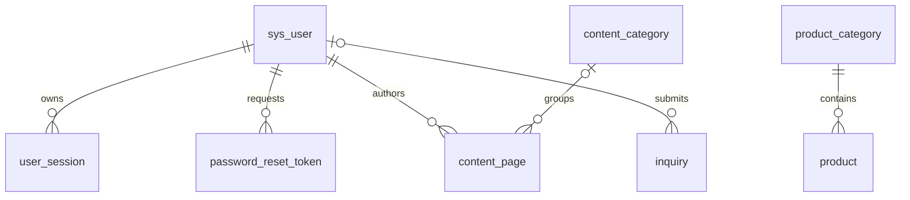
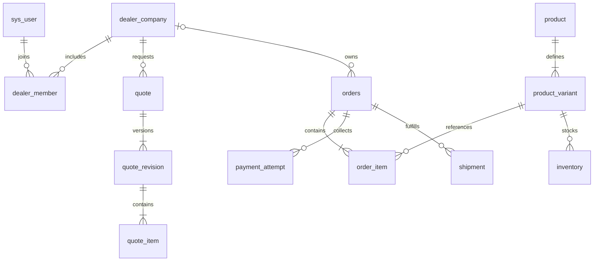

# 数据库结构与演进基线

这是设计字典，**不是已执行DDL**。课程采用尽可能小的真实结构，长期模型在对应阶段迁移；不要为远景一次建几十张空表。

## 统一约定

MySQL8.4 / InnoDB / utf8mb4，时间存UTC `DATETIME(3)`，API返回ISO8601；新数字主键用BIGINT，API输出字符串避免JavaScript精度丢失。保留已有经销商申请业务单号，内部数字键与对外单号分开。表名沿用现有单数snake_case，字段snake_case，DTO采用camelCase。

常规可修改实体有 `created_at/updated_at/version`；version为乐观锁整数，条件更新影响0行时返回409。金额使用DECIMAL与币种，API返回十进制字符串，禁止浮点金额计算。文本自由字段与JSON限制长度及结构，需搜索/关联的字段必须结构化。

关键业务采用归档/停用，订单、审核和审计不物理删除；纯关联表可按父对象约束删除。FK默认RESTRICT；中间表明确使用CASCADE。审计由后端写入，日志对密码、Cookie、令牌、资质内容脱敏。

## 课程核心表

下表列出的“新增/调整”为下一步开发任务。历史演示库不直接升级成生产库。

| 表 | 关键字段 | 约束与索引 | 归属 |
| --- | --- | --- | --- |
| `sys_user` 调整 | id, username, email, password_hash, role, status, avatar_key, phone, last_login_at, version | username/email规范化后UNIQUE；role课程仅USER/ADMIN/SUPER_ADMIN；注册不可指定role | identity |
| `user_session` 新增 | id, user_id, session_hash, expires_at, last_seen_at | hash唯一；FK user；expires_at索引；只保存不可逆摘要或成熟会话库的受控数据 | identity |
| `password_reset_token` 新增 | id, user_id, token_hash, expires_at, used_at | hash唯一；FK user；过期与单次消费；只存摘要 | identity |
| `product_category` 调整 | id, name, slug, parent_id, sort_order, version | slug唯一；parent自引用；拒绝循环；有产品时禁止直接删类别 | catalog |
| `product` 调整 | id, sku, slug, category_id, name, summary, description, images_json, specs_json, is_published, is_featured, archived_at可空, price, dealer_price, version | sku/slug唯一；category FK；(is_published,category_id,id)；公开DTO不返回dealer_price | catalog |
| `content_category` 新增 | id, name, slug, sort_order | slug唯一；被引用禁止直接删 | content |
| `content_page` 新增 | id, type, slug, category_id, title, summary, body_html, cover_key, status, published_at, author_id, version | type=NEWS/PAGE；slug唯一；category/user FK；(type,status,published_at,id) | content |
| `site_setting` 新增 | setting_key, value_json, updated_by, updated_at | key主键；只允许品牌/联系等白名单配置；不存密钥 | operation |
| `banner` 新增 | id, title, image_key, link_url, sort_order, status, version | status/sort_order索引；只允许合法相对地址或http(s)链接 | operation |
| `inquiry` 新增 | id, ticket_no, user_id可空, name, email, subject, message, internal_note可空, status, assignee_id可空, created_at, version | ticket_no唯一；user/assignee FK；(status,created_at,id)；本人或授权后台可读 | support |
| `media_asset` 新增 | id, file_key, mime, size_bytes, checksum, alt_text, visibility, uploaded_by, created_at | file_key唯一；课程PUBLIC，仅白名单媒体选择/受控上传；支持图集引用 | media |
| `audit_event` 新增 | id, actor_id可空, action, entity_type, entity_id, summary_json, request_id, created_at | (entity_type,entity_id,created_at)及(actor_id,created_at)；后台不可编辑 | shared |

`product.images_json` 课程保留有序媒体key数组，最多10项；如启用数据库JSON类型，迁移前校验已有JSON，异常隔离不静默丢弃。服务端逐项验证媒体存在。课程搜索采用参数化LIKE，分页20/最大100，数据量不支持性能目标时先分析查询计划。

`content_page` 课程只做固定类型和经清洗的富文本，不做可视化搭建器。表中price仅表示展示参考价，不产生订单承诺；如价格来源无法核实则隐藏。

### 课程关系

### 经销商可裁剪增强

复用 `dealer_application`，增加 applicant_user_id、reviewed_by、version、updated_at；外键关联用户。课程状态只用PENDING/APPROVED/REJECTED；同一申请只准条件转换一次，审核结果写审计。审核通过可创建最小 `dealer_company` 并关联用户，但**不自动赋予后台权限或开放价格/订单**。

课程的单一 `sys_user.company_id` 只满足一个用户属于一个企业的受限模型；真正的多企业/多成员授权在M4增加关系表后开放。现有orders/order_item保留为历史演示脚本内容，课程新业务不依赖它们。

## 长期领域结构

| 阶段/领域 | 表及主要关联 | 不变量 |
| --- | --- | --- |
| M4 身份 | role、permission、user_role、role_permission；user_mfa | 逐模块动作授权，管理员强制MFA；与sys_user兼容迁移 |
| M4 经销商 | dealer_company、dealer_member(company_id,user_id,role,status)、application_review、dealer_location、company_address | 成员关系UNIQUE(company_id,user_id)；企业停用即时禁止访问；门店公开需授权 |
| M4 产品 | product_variant(product_id,sku,options_json)、product_media(product_id,media_id,sort_order)、product_attribute/value | 默认SKU一对一迁出旧product.sku；SKU唯一；筛选属性不能仅存任意JSON |
| M4 内容/媒体 | content_revision(page_id,revision,body)、page_section(page_id,type,config,sort)、content_product、media_version、download_resource、download_grant | revision组合唯一；白名单模块schema；私有文件只有短时签名访问 |
| M4 支持 | inquiry_message、inquiry_assignment、faq、faq_category、notification | 内部备注与对外回复分开；通知失败可重试，内容脱敏 |
| M5 国际化 | market、locale、product_translation(product_id,locale,slug)、content_translation、product_market、url_redirect | 组合slug唯一；货币/可售市场确定后再定价；301禁止循环 |
| M5 价格 | price_list、price_list_item(variant_id,currency,min_qty,valid_from/to,amount)、company_price_list、dealer_tier | 同优先级区间不得重叠；金额非负；企业覆盖>企业表>等级表>默认B2B |
| M5 报价 | quote(company_id,quote_no,status)、quote_revision(quote_id,version,expiry,terms)、quote_item(revision_id,variant_id,qty,amount) | 版本不可变；过期不能接受；转换订单一次且审计 |
| M5 订单 | orders(user_id,company_id,channel,currency,payment_status,fulfillment_status,total)、order_item、order_address_snapshot、order_status_history | SKU/名称/价税/地址快照；订单不能默认PAID；企业所有权显式存储 |
| M5 库存 | warehouse、inventory(variant_id,warehouse_id,on_hand,reserved)、inventory_reservation、inventory_movement | variant/warehouse唯一；on_hand>=reserved>=0；预占有到期和幂等释放 |
| M5 付款履约 | payment_attempt、payment_event、refund、shipment、shipment_item、return_request | provider/event_id唯一；退款累计<=已收款；发货数量不超订单行 |
| 按需可靠任务 | outbox_event、idempotency_record(scope,key,request_hash,result,expiry) | 业务与outbox同事务；重试不重复生效；同键不同载荷返回409 |

业务账户系统只有一个，未来B2C/B2B共享产品与SKU；企业不是另一套重复产品库。多语言表按实体设计，禁止用一个任意JSON承担所有核心关系。日志可记录通用entity_id，但不能以无FK的多态字段代替交易关联。

## 事务与一致性

课程审核使用带version与当前status的条件更新，审核与企业关联/审计在同一事务。发布只允许完整的产品/内容变为已发布；新建产品没有主图或分类则拒绝。密码重置在同一事务消费token、更新密码并撤销旧会话。

未来下单在服务端重新计算价格并保存快照；库存采用条件更新或行锁，按SKU固定顺序锁定，失败整单回滚。支付通过校验签名、金额/币种/订单匹配后的服务端回调推进，重复回调以唯一事件号去重；浏览器成功页不得写PAID。退款、发货与库存移动各有独立状态与数量约束，不能塞进单个通用status。企业资源按服务端会话选定company_id查询，外部提交的company_id只可用于匹配验证。

## 迁移和恢复

1. 保留旧演示SQL，添加说明，不执行/改写。M0为新空的 `wemove_course_dev` 创建基础迁移；不得复用含重要数据的库名。
2. 每个PR提交新迁移，统一编号/时间戳，禁止自动synchronize和修改已执行历史。测试空库全迁移和上一版本升级；运行同一迁移入口第二次应不重复执行。
3. 演示seed单独脚本、环境白名单、固定合成数据；管理员密码通过本地环境注入并哈希，仓库不写默认生产密码。
4. 增量改结构先新增兼容字段→回填/检查→切读写→确认旧消费者退出后删旧字段。旧product.sku迁到variant时保留旧接口适配一个版本。
5. 发布前备份并在另一空库恢复核对表数/关键行数；DDL失败不能假定事务回滚，使用备份或向前修复脚本。课程不对共享库运行自动down清库。

课程目标RPO24小时/RTO2小时，必须记录实际演练结果；商业阶段目标RPO15分钟/RTO1小时并配置备份与恢复演练后才能承诺。
