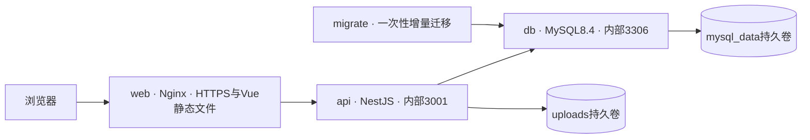

# Docker Compose与Linux部署基线

_用户已确认使用Docker并部署到Linux服务器 · 规划版本0.2 · 2026-09-05_

课程交付环境统一为 **Linux服务器 + Docker Engine + Docker Compose插件**。本文件是部署任务的设计与验收依据；目前尚无后端应用、Dockerfile或Compose配置，也未连接服务器，不能视为已上线。

## 运行结构

采用单机Compose，满足2–3天作业的部署规模。Docker官方支持在单台服务器使用Compose部署，并用生产覆盖文件调整环境。[^1]



| 服务 | 镜像与职责 | 网络/生命周期 |
| --- | --- | --- |
| `web` | Node24阶段构建Vue；Nginx阶段只放dist与代理配置 | 服务器仅此服务映射80/443；长期运行 |
| `api` | Node24多阶段构建NestJS，生产运行编译产物和生产依赖 | 内部3001，连接db；非root用户，长期运行 |
| `db` | MySQL8.4，精确补丁/镜像摘要在实现时验证并记录 | 内部3306，无公网端口映射；mysql_data卷 |
| `migrate` | 与api相同版本镜像，运行已编译的迁移入口 | tools profile，一次性执行，成功才更新应用 |
| `mailpit` 可选 | 只用于开发/课堂模拟邮件收取 | dev profile；管理页面只绑定回环地址，经SSH隧道查看 |

`web`/`api`加入应用网络，`api`/`db`加入数据网络，db不加入入口网络。应用连接使用Compose服务名 `DB_HOST=db`，不能使用容器内部的localhost连接另一服务。无需Redis、消息队列或Kubernetes。

## Linux服务器约定

现有服务器先核对发行版、CPU架构、空闲端口/磁盘和已运行服务。新建环境可采用Ubuntu24.04 LTS；Docker官方列出受支持的Ubuntu版本和安装方式。[^2] 课程初始资源预算可从2核4GB评估，必须以实际构建和压测验证，不保证该配置达标，也不要求现在购买服务器。

采用官方Docker Engine与Compose插件，记录版本。服务器不需要直接安装应用用的Node/MySQL；镜像架构匹配实际服务器，不能把Windows的node_modules复制进Linux镜像。现有其他容器、服务和端口保留，冲突由部署任务调整。

建议服务器目录：`/srv/wemove/releases/<commit>/` 保存每版配置/发布记录，`/srv/wemove/.env` 保存服务器配置，`/srv/wemove/secrets/` 保存受限权限的秘密文件，`/srv/wemove/backups/` 保存备份。Compose统一项目名 `wemove`，让不同release目录使用同一组明确命名的数据卷。

有域名时在Nginx终止HTTPS，证书目录只读挂载，记录续期流程；已有反向代理时复用现有TLS入口，避免端口冲突。尚无域名/证书时可通过SSH隧道进行内部HTTP验收；公网账户功能开放前必须完成HTTPS，不把生产Cookie降级来绕过配置问题。

## 开发任务需新增的文件

| 文件 | 负责人 | 验收 |
| --- | --- | --- |
| `frontend/Dockerfile`、`frontend/.dockerignore` | chenyi-c实现，lizhikeer确认静态构建 | npm ci与build在Linux镜像内完成，Nginx镜像不含源码/开发依赖 |
| `backend/Dockerfile`、`backend/.dockerignore` | cy0207kaw | 编译服务与迁移；非root运行，优雅退出与健康检查 |
| `compose.yaml`、`compose.prod.yaml` | chenyi-c | 三个服务、一次性迁移、网络/卷/健康依赖/日志上限/重启策略 |
| `compose.dev.yaml`（确需热更新时） | chenyi-c协调 | 只在开发覆盖中挂载源码；正式部署不挂源码或Windows依赖 |
| `infra/nginx/default.conf`、`.env.example` | chenyi-c、cy0207kaw | 同源API代理、HTTPS/转发头、无秘密的环境说明 |
| `docs/delivery/deployment.md`、`backup-restore.md` | chenyi-c、Snowed-night | Linux实测启动、升级、重建容器、备份恢复与回滚记录 |

课程先在Linux服务器从已审核的commit构建，镜像标记该commit；保留前一版镜像和配置用于回滚。构建时记录基础镜像版本/摘要，不用latest作为发布标识。后续CI稳定后再转为构建一次、镜像仓库分发；不新增当前不需要的镜像仓库依赖。

## 环境 网络与数据

公开环境字段包含APP_ENV、APP_ORIGIN、DB_HOST/DB_PORT/DB_NAME/DB_USER、SMTP_HOST/PORT与RELEASE_SHA；DB密码、root初始化密码、会话密钥、SMTP凭据使用服务器文件/Compose secrets注入，镜像和仓库不包含真实值。API实现读取秘密文件的约定；`.env.example`只有字段说明。

只映射web端口；db/api不在服务器声明公网ports。Docker发布端口可能绕开部分宿主防火墙规则，验收必须实际从外部确认端口，而不能只看ufw配置。[^2] 不开放Docker TCP管理端口，不给应用挂载Docker socket。

Nginx `/api/` 保留完整路径转发到 `api:3001`，API404原样返回，不能落入SPA的index.html；其余前端页面才使用SPA回退。代理转发Host/协议，后端只信任受控代理，保证Secure Cookie与CSRF按实际HTTPS工作。

MySQL数据挂载到命名卷 `mysql_data`，API上传目录挂 `uploads` 卷；上传文件由API按可见性受控提供，不直接公开卷根目录。容器删除/重建与数据生命周期分离；卷不是备份。[^3] 禁止把旧DROP脚本挂入MySQL自动初始化目录，禁止用删除数据卷的命令升级服务。

## 首次部署与升级流程

1. chenyi-c在B00记录服务器地址、SSH用户/密钥使用方式、发行版/架构、域名、端口与路径；秘密通过受控方式保存，不写Issue。未获得服务器访问方式前只完成本地准备。
2. 实现Dockerfile/Compose后，先校验解析与环境必填项，再在目标Linux构建web/api和同版本migrate镜像。使用固定项目名与镜像标签，保留构建日志。
3. 启动db并等待健康检查成功。Compose的“运行中”不等于依赖可用，使用healthcheck与service_healthy；迁移成功条件单独检查。[^4]
4. 运行一次migrate，失败即停止发布；只有首次空的课程库才显式运行合成seed。API启动不执行schema同步或自动seed。
5. 启动api/web并检查健康；浏览器验证首页、真实登录、后台写入与跨浏览器持久化。经销商P1未实现时不阻塞核心，但对应入口应清楚。
6. 升级前保存备份和上一版发布清单；构建新镜像→先跑兼容迁移→重建api/web→烟测。不先删除整套环境；单机短暂停机在课程记录中说明。

以下是**未来Compose文件实现后的命令约定，目前不可运行**。在已确认的release目录执行；migrate service定义实际迁移命令，不能用占位成功脚本。

```bash
docker compose -p wemove --env-file /srv/wemove/.env -f compose.yaml -f compose.prod.yaml config --quiet
docker compose -p wemove --env-file /srv/wemove/.env -f compose.yaml -f compose.prod.yaml build web api
docker compose -p wemove --env-file /srv/wemove/.env -f compose.yaml -f compose.prod.yaml up -d --wait db
docker compose -p wemove --env-file /srv/wemove/.env -f compose.yaml -f compose.prod.yaml --profile tools run --rm migrate
docker compose -p wemove --env-file /srv/wemove/.env -f compose.yaml -f compose.prod.yaml up -d --wait api web
```

## 备份 回滚与验收

Snowed-night提供逻辑备份和恢复脚本：对InnoDB使用一致性快照，备份时不做DDL；上传卷同步备份并记录同一检查点。保留至少最近7天备份并复制一份到服务器之外；课堂敏感/测试数据不得直接传到公开仓库。每天和发布前执行，至少在独立恢复库实测一次。

回滚应用使用上个commit对应的镜像和配置；只有新数据库结构向后兼容时才能直接回滚镜像。破坏性DDL不能靠重启容器恢复，按数据库向前修复或已演练的备份恢复步骤处理。

Q04必须在Linux完成Compose解析、镜像构建、三服务健康、API错误路由、上传与DB重建不丢数据、日志截断/轮转、重启恢复、HTTPS/Cookie及外部端口检查。Q03在该实际部署上跑业务/性能验收。Windows本地build只证明前端能编译，不能代替Linux容器和服务器验收。

[^1]: Docker官方生产Compose指南 https://docs.docker.com/compose/how-tos/production/
[^2]: Docker官方Ubuntu安装与网络注意事项 https://docs.docker.com/engine/install/ubuntu/
[^3]: Docker官方卷文档 https://docs.docker.com/engine/storage/volumes/
[^4]: Docker官方启动顺序与健康依赖 https://docs.docker.com/compose/how-tos/startup-order/
