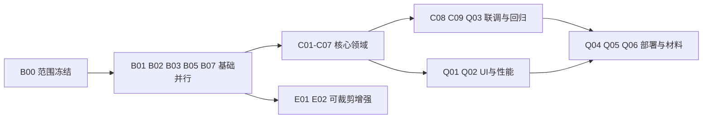

# 七人分工与三天执行路线

七个GitHub账号已从仓库协作者列表核实。以下是本次制定的分配，不是既有实名分工或对成员技术水平的判断。姓名映射由团队自行补录；用户名保持原样。

## 分工

| 成员 | 主责 | 前期工作 | 最终交付 | 首要互审人 |
| --- | --- | --- | --- | --- |
| **lizhikeer** | 前端公共架构与全站最终UI | services、路由/布局、统一状态、tokens/公共组件、首批前端联调 | 全站UI统一、首页/产品页重点打磨、响应式与资源性能 | serein7758521 |
| **cy0207kaw** | 后端平台与账户 | NestJS骨架、契约、会话/权限、注册登录/找回密码 | 账户中心、用户启停、管理员管理及相关测试 | GLOCKDDD |
| **Snowed-night** | 数据库基线与产品领域 | 新库迁移/seed约定、产品/分类API | 产品前台、产品/分类后台、多图与搜索分页 | cy0207kaw |
| **serein7758521** | 内容领域 | 新闻/品牌字段、内容API与用例 | 首页/新闻/品牌页面、新闻/分类后台、答辩内容统稿 | lizhikeer |
| **22099yang** | 支持与媒体 | 必需资源核对、媒体白名单、联系表单API | 联系/支持页面、留言后台，时间允许再做FAQ/受控上传 | chenyi-c |
| **GLOCKDDD** | 跨模块测试与经销商 | 测试用例、越权/找回/停用账户验证，协助首个闭环 | 最小经销商申请审核（可裁剪）、核心回归测试 | Snowed-night |
| **chenyi-c** | 运营领域与交付协调 | 范围冻结、CI/规范、网站配置/Banner | 独立运营页面/API、部署说明、材料清单与发布组织 | 22099yang |

前端UI最后由lizhikeer统一，各领域负责人仍需先交付可用页面并自行修复业务缺陷。他不承担全组后端、所有CRUD或全部回归。chenyi-c的运营模块只负责配置、Banner和只读汇总；产品、内容、经销商、用户后台仍属于各自领域。

## 任务预算

见 [任务索引](issue-index.md) 的小时估算。规划按七人每天约6个有效工作小时、最多3天计算；估算是排期工具，不能当成实际贡献证据。每人另预留约2小时做互审、跨模块演示、个人技术报告及答辩准备；第3天余量用于缺陷修复。

每人最多1个实现任务进行中，基础任务可拆2–4小时PR。M0任务密集，lizhikeer多承担前端基础，但API与鉴权明确交给cy0207kaw，数据库交给Snowed-night，避免单人阻塞全组。

| 成员 | 领域任务估算小时 | 说明 |
| --- | --- | --- |
| lizhikeer | 12 | 前期5小时、最终UI与性能7小时 |
| cy0207kaw | 11 | 后端骨架、身份、账户 |
| Snowed-night | 8 | 数据库与产品 |
| serein7758521 | 8 | 内容与答辩统稿 |
| 22099yang | 8 | 含可裁剪增强3小时 |
| GLOCKDDD | 12 | 含可裁剪经销商4小时 |
| chenyi-c | 9 | 运营与交付协调 |

合计68小时领域工作，另14小时全员共同工作，共82小时规划投入。3天按每人6有效小时提供126小时容量，余量用于学习、联调与缺陷。仅2天时先删7小时P1，再将最终UI控制为3小时、性能处理1小时；GLOCKDDD协助cy0207kaw完成约2小时账户后台工作，使个人负荷也不超过约12小时。工时与减项需在启动会核对，若核心仍落后则记录风险并集中修复。

## 时间表

| 时间 | 全组检查点 | lizhikeer关注点 | 其他成员 |
| --- | --- | --- | --- |
| 第1天开始0–2小时 | 冻结R01–R07、字段、角色、URL、mock边界 | 页面清单、services约定、tokens | 后端/迁移并行；各领域实现独立模块和用例 |
| 第1天上午结束 | API存活、数据库连接、至少注册/登录最小路径 | 公共请求与反馈组件可用 | 身份和领域API有样例响应 |
| 第1天下午结束 | 至少一条新闻/产品从后台入库到前台显示 | 首个真实页面联调 | 其他核心模块继续并行，验证401/403 |
| 第2天中午 | R01–R05核心闭环可演示；问题清单可重现 | 支援前端接API并冻结公共接口 | 未闭环时取消P1、集中补核心 |
| 第2天下午 | 完成核心验证与材料初稿 | 全站UI统一，保留兼容 | 条件允许做经销商增强；否则协助回归 |
| 第3天上午 | 功能冻结，备份/部署复现，主要屏宽与浏览器检查 | 视觉/可访问性/性能修复 | 各自修复缺陷，核对需求与测试证据 |
| 第3天下午 | 七人轮流演示、材料打包、贡献核对 | UI验收截图 | 两次答辩演练，最终版本记录 |

没有日期承诺之外的自动排期：实际T0和答辩时刻由B00填写。M2经销商不阻塞M3课程核心验收。第2天模式在第2天中午冻结功能，当晚完成交付，所有P1推迟到M4。

## 依赖与交接

Issue里的Depends on指集成前置；不阻止在契约已冻结后编写独立模块。C08/C09可以先写用例，后运行真实API；没有测试结果之前不能关闭。等待公共模块时写领域代码与样例，禁止各自建立第二套服务。

## 协作节奏和贡献记录

每天开始用10分钟确认目标，中午15分钟演示进展，结束前20分钟合并与检查；议事记录写决策、理由、责任人和下一步，不把聊天记录当课程沟通记录。半天一次集成，不等最后一天总合并。

每人最终提交自己的Web开发技术现状报告及工作证据。工作量表包含成员、任务、PR/commit、实耗、验收结果和共同工作，七人核对后计算占比；本轮不编造已完成工时、签名、会议内容或占比。

## 长期人员安排

M4/M5中成员继续负责原领域：lizhikeer主导Nuxt与设计体系，cy0207kaw主导身份平台，Snowed-night主导SKU/价格与数据库，serein7758521主导CMS/SEO与本地化，22099yang主导媒体/售后服务，GLOCKDDD主导经销商/报价，chenyi-c协调订单运营、部署和外部集成。长期任务是Epic，不形成三天作业的额外承诺；阶段启动时按人员可用性重新估算。
